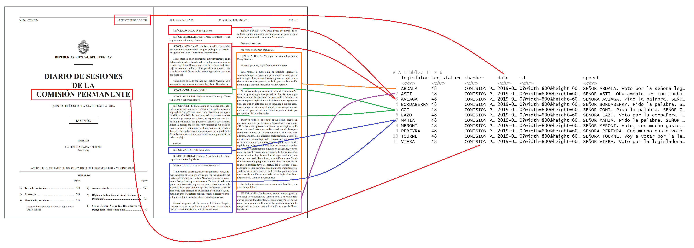

```{r, include = FALSE}
knitr::opts_chunk$set(
  collapse = TRUE,
  comment = "#>",
  fig.path = "man/figures/README-",
  out.width = "80%"
)
```

## The `speech` package 

_Nicolás Schmidt, Diego Luján, Juan Andrés Moraes_

<!-- badges: start -->
[](https://cran.r-project.org/package=speech)
`r badger::badge_devel("Nicolas-Schmidt/speech", "orange")`
[](https://github.com/Nicolas-Schmidt/speech/actions)
[](https://www.repostatus.org/#active)
[](https://www.r-pkg.org/pkg/speech)


<!-- badges: end -->

### Description

Converts the floor speeches of Uruguayan legislators, extracted from the parliamentary minutes, to tidy data.frame where each observation is the intervention of a single legislator.

### Installation

```r
# Install speech from CRAN
install.packages("speech")

# The development version from GitHub:
if (!require("remotes")) install.packages("remotes")
remotes::install_github("Nicolas-Schmidt/speech")
```


### Data generation process


#### 1 - Floor speeches

</a>


#### 2 - Data extraction

</a>


#### 3 - First construction of the database: `speech::speech_build()`

</a>


#### 4 - Final database: `speech::speech_build(., compiler = TRUE)`

</a>


### Example

You can see more complex examples in the following [link](https://github.com/Nicolas-Schmidt/speech-ejemplos).


```{r example}
library(speech)
url <- "https://parlamento.gub.uy/documentosyleyes/documentos/diario-de-sesion/comisionpermanente/6084/IMG/0?width=800&height=600&hl=en_US1&iframe=true&rel=nofollow"
text <- speech::speech_build(file = url)
text


speech_check(text, initial = c("A", "M"))


text <- speech::speech_build(file = url, compiler = TRUE)
text


text$word <- speech_word_count(text$speech)

dplyr::glimpse(text)

```


### Possible application
```{r, out.width = "100%", warning=FALSE}
library(magrittr)

minchar <- function(string, min = 3){
    string <- stringr::str_remove_all(string, "[[:punct:]]")
    string <- unlist(strsplit(string, " "))
    string[nchar(string) > min]
}

text$speech %>% 
    minchar(., min = 4) %>%  
    quanteda::corpus() %>% 
    quanteda::dfm(remove = c("señor", "señora")) %>% 
    quanteda.textplots::textplot_wordcloud(color = rev(RColorBrewer::brewer.pal(10, "RdBu")))

```

```{r}
library(ggplot2)

text$speech %>% 
    minchar(., min = 4) %>%  
    tibble::enframe() %>% 
    tidytext::unnest_tokens(word, value) %>%
    dplyr::count(word, sort = TRUE) %>%
    dplyr::mutate(word = stats::reorder(word, n)) %>%
    dplyr::filter(!stringr::str_detect(word, "^señor")) %>% 
    .[1:40,] %>% 
    ggplot(aes(word, n)) +
        geom_col(col = "black", fill = "#00A08A", width = .7) +
        labs(x = "", y = "") +
        coord_flip() +
        theme_minimal()
```

#### Citation

To cite package`speech` in publications, please use:

```{r, warning=FALSE}
citation(package = 'speech')
```

#### Maintainer

Nicolas Schmidt (<nschmidt@cienciassociales.edu.uy>)


