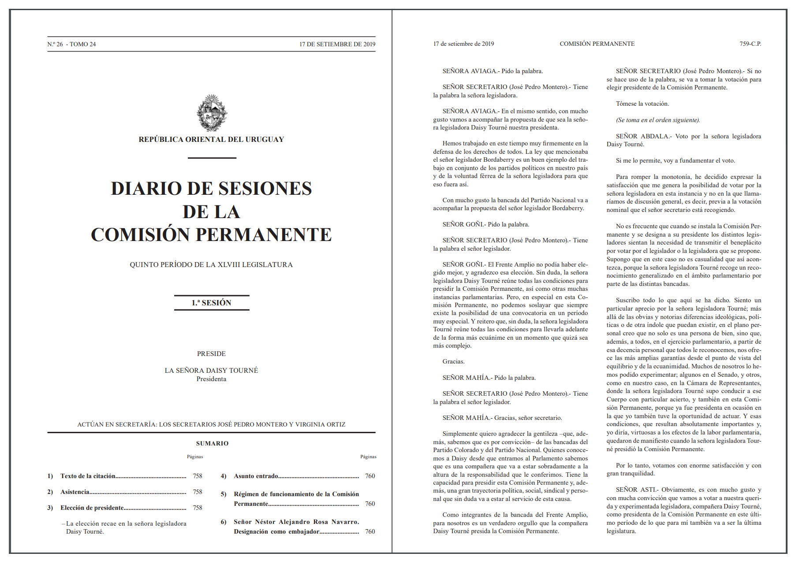

## The `speech` package 

*Nicolás Schmidt, Diego Luján, Juan Andrés Moraes*

<!-- badges: start -->

[](https://cran.r-project.org/package=speech)
[](https://github.com/Nicolas-Schmidt/speech)
[](https://github.com/Nicolas-Schmidt/speech/actions)
[](https://www.repostatus.org/#active)
[](https://www.r-pkg.org/pkg/speech)
[](https://www.r-pkg.org/pkg/speech)

<!-- badges: end -->

### Description

Converts the floor speeches of Uruguayan legislators, extracted from the
parliamentary minutes, to tidy data.frame where each observation is the
intervention of a single legislator.

### Installation

``` r
# Install speech from CRAN
install.packages("speech")

# The development version from GitHub:
if (!require("remotes")) install.packages("remotes")
remotes::install_github("Nicolas-Schmidt/speech")
```

### Data generation process

#### 1 - Floor speeches

</a>

#### 2 - Data extraction

</a>

#### 3 - First construction of the data set: `speech::speech_build()`

</a>

#### 4 - Final data set: `speech::speech_build(., compiler = TRUE)`

</a>

### Example

You can see more complex examples in the following
[**link**](https://github.com/Nicolas-Schmidt/speech-ejemplos).

``` r
library(speech)
url <- "https://parlamento.gub.uy/documentosyleyes/documentos/diario-de-sesion/comisionpermanente/6084/IMG/0?width=800&height=600&hl=en_US1&iframe=true&rel=nofollow"
text <- speech::speech_build(file = url)
text
#> # A tibble: 24 x 7
#>    legislator speech                  chamber date       legislature id      sex
#>    <chr>      <chr>                   <chr>   <date>           <int> <chr> <dbl>
#>  1 BORDABERRY SEÑOR BORDABERRY. Pido~ COMISI~ 2019-09-17          48 0?wi~     1
#>  2 BORDABERRY SEÑOR BORDABERRY. Prop~ COMISI~ 2019-09-17          48 0?wi~     1
#>  3 AVIAGA     SEÑORA AVIAGA. Pido la~ COMISI~ 2019-09-17          48 0?wi~     0
#>  4 AVIAGA     SEÑORA AVIAGA. En el m~ COMISI~ 2019-09-17          48 0?wi~     0
#>  5 GOÑI       SEÑOR GOÑI. Pido la pa~ COMISI~ 2019-09-17          48 0?wi~     1
#>  6 GOÑI       SEÑOR GOÑI. El Frente ~ COMISI~ 2019-09-17          48 0?wi~     1
#>  7 MAHIA      SEÑOR MAHIA. Pido la p~ COMISI~ 2019-09-17          48 0?wi~     1
#>  8 MAHIA      SEÑOR MAHIA. Gracias, ~ COMISI~ 2019-09-17          48 0?wi~     1
#>  9 ABDALA     SEÑOR ABDALA. Voto por~ COMISI~ 2019-09-17          48 0?wi~     1
#> 10 ASTI       SEÑOR ASTI. Obviamente~ COMISI~ 2019-09-17          48 0?wi~     1
#> # ... with 14 more rows


speech_check(text, initial = c("A", "M"))
#> $A
#>   legislator
#> 1     ABDALA
#> 2       ASTI
#> 3     AVIAGA
#> 
#> $M
#>   legislator
#> 1      MAHIA
#> 2     MERONI


text <- speech::speech_build(file = url, compiler = TRUE)
text
#> # A tibble: 11 x 7
#>    legislator legislature chamber             date       id         speech   sex
#>    <chr>            <int> <chr>               <date>     <chr>      <chr>  <dbl>
#>  1 ABDALA              48 COMISION PERMANENTE 2019-09-17 0?width=8~ SEÑOR~     1
#>  2 ASTI                48 COMISION PERMANENTE 2019-09-17 0?width=8~ SEÑOR~     1
#>  3 AVIAGA              48 COMISION PERMANENTE 2019-09-17 0?width=8~ SEÑOR~     0
#>  4 BORDABERRY          48 COMISION PERMANENTE 2019-09-17 0?width=8~ SEÑOR~     1
#>  5 GOÑI                48 COMISION PERMANENTE 2019-09-17 0?width=8~ SEÑOR~     1
#>  6 LAZO                48 COMISION PERMANENTE 2019-09-17 0?width=8~ SEÑOR~     0
#>  7 MAHIA               48 COMISION PERMANENTE 2019-09-17 0?width=8~ SEÑOR~     1
#>  8 MERONI              48 COMISION PERMANENTE 2019-09-17 0?width=8~ SEÑOR~     1
#>  9 PEREYRA             48 COMISION PERMANENTE 2019-09-17 0?width=8~ SEÑOR~     0
#> 10 TOURNE              48 COMISION PERMANENTE 2019-09-17 0?width=8~ SEÑOR~     0
#> 11 VIERA               48 COMISION PERMANENTE 2019-09-17 0?width=8~ SEÑOR~     1


text$word <- speech_word_count(text$speech)

dplyr::glimpse(text)
#> Rows: 11
#> Columns: 8
#> $ legislator  <chr> "ABDALA", "ASTI", "AVIAGA", "BORDABERRY", "GOÑI", "LAZO", ~
#> $ legislature <int> 48, 48, 48, 48, 48, 48, 48, 48, 48, 48, 48
#> $ chamber     <chr> "COMISION PERMANENTE", "COMISION PERMANENTE", "COMISION PE~
#> $ date        <date> 2019-09-17, 2019-09-17, 2019-09-17, 2019-09-17, 2019-09-17~
#> $ id          <chr> "0?width=800&height=600&hl=en_US1&iframe=true&rel=nofollo~
#> $ speech      <chr> "SEÑOR ABDALA. Voto por la señora legisladora Daisy Tourné~
#> $ sex         <dbl> 1, 1, 0, 1, 1, 0, 1, 1, 0, 0, 1
#> $ word        <int> 398, 46, 105, 951, 98, 103, 126, 12, 12, 111, 8
```

### Possible application

``` r
library(magrittr)

minchar <- function(string, min = 3){
    string <- stringr::str_remove_all(string, "[[:punct:]]")
    string <- unlist(strsplit(string, " "))
    string[nchar(string) > min]
}

text$speech %>% 
    minchar(., min = 4) %>%  
    quanteda::corpus() %>% 
    quanteda::dfm(remove = c("señor", "señora")) %>% 
    quanteda.textplots::textplot_wordcloud(color = rev(RColorBrewer::brewer.pal(10, "RdBu")))
```


``` r
library(ggplot2)

text$speech %>% 
    minchar(., min = 4) %>%  
    tibble::enframe() %>% 
    tidytext::unnest_tokens(word, value) %>%
    dplyr::count(word, sort = TRUE) %>%
    dplyr::mutate(word = stats::reorder(word, n)) %>%
    dplyr::filter(!stringr::str_detect(word, "^señor")) %>% 
    .[1:40,] %>% 
    ggplot(aes(word, n)) +
        geom_col(col = "black", fill = "#00A08A", width = .7) +
        labs(x = "", y = "") +
        coord_flip() +
        theme_minimal()
```


### Detecting roll-call votes in parliamentary speeches

``` r
urls <- speech_url(chamber = "D", days = c("12-06-2002", "14-04-2004"))
rollcall <- speech_rollcall(file =  urls)

rollcall
#> # A tibble: 165 x 10
#>    legislator       vote argument speech chamber date       legislature rollcall
#>    <chr>           <dbl>    <dbl> <chr>  <chr>   <date>           <int>    <int>
#>  1 ABDALA              0        0 SEÑOR~ CAMARA~ 2002-06-12          45        1
#>  2 AGAZZI              1        1 SEÑOR~ CAMARA~ 2002-06-12          45        1
#>  3 AMEN VAGHETTI       0        0 SEÑOR~ CAMARA~ 2002-06-12          45        1
#>  4 AMORIN BATLLE       0        0 SEÑOR~ CAMARA~ 2002-06-12          45        1
#>  5 ARAUJO              0        1 SEÑOR~ CAMARA~ 2002-06-12          45        1
#>  6 ARGENZIO            0        1 SEÑOR~ CAMARA~ 2002-06-12          45        1
#>  7 ARGIMON             0        0 SEÑOR~ CAMARA~ 2002-06-12          45        1
#>  8 ARRARTE FERNAN~     1        0 SEÑOR~ CAMARA~ 2002-06-12          45        1
#>  9 ARREGUI             1        1 SEÑOR~ CAMARA~ 2002-06-12          45        1
#> 10 BARAIBAR            1        0 SEÑOR~ CAMARA~ 2002-06-12          45        1
#> # ... with 155 more rows, and 2 more variables: id <chr>, sex <dbl>

summary(rollcall)
#> # A tibble: 2 x 10
#>   Chamber Date       Legislators Affirmative Negative prop_AF prop_NG prop_women
#>   <chr>   <date>           <int>       <dbl>    <dbl>   <dbl>   <dbl>      <dbl>
#> 1 CRR     2002-06-12          92          45       47    48.9    51.1       13.0
#> 2 CRR     2004-04-14          73          32       41    43.8    56.2       15.1
#> # ... with 2 more variables: prop_arg <dbl>, rc <int>
```

#### Citation

To cite package`speech` in publications, please use:

``` r
citation(package = 'speech')
#> 
#> To cite package 'speech' in publications use:
#> 
#>   Nicolas Schmidt, Diego Lujan and Juan Andres Moraes (NA). speech:
#>   Legislative Speeches. R package version 0.1.5.
#>   https://github.com/Nicolas-Schmidt/speech
#> 
#> A BibTeX entry for LaTeX users is
#> 
#>   @Manual{,
#>     title = {speech: Legislative Speeches},
#>     author = {Nicolas Schmidt and Diego Lujan and Juan Andres Moraes},
#>     note = {R package version 0.1.5},
#>     url = {https://github.com/Nicolas-Schmidt/speech},
#>   }
```

#### Maintainer

Nicolas Schmidt (<nschmidt@cienciassociales.edu.uy>)
