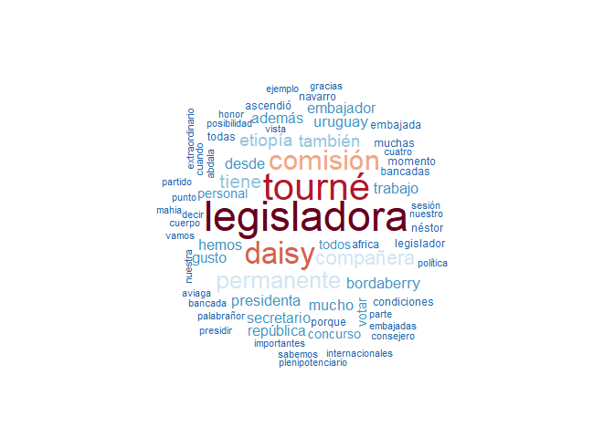

<!-- README.md is generated from README.Rmd. Please edit that file -->

## The `speech` package 

*Nicolas Schmidt, Diego Lujan, Juan Andres Moraes*

<!-- badges: start -->

<!-- badges: end -->

### Description

Contains functions to convert floor speeches of Uruguayan legislators
from PDF to tidy and clean data.frame.

### Installation

``` r
# The development version from GitHub:
if (!require("remotes")) install.packages("remotes")
remotes::install_github("Nicolas-Schmidt/speech")
```

### Data generation process

#### 1 - Floor speeches

</a>

#### 2 - Data extraction

</a>

#### 3 - First construction of the database: `speech::speech_build()`

</a>

#### 4 - Final database: `speech::speech_build(., compiler = TRUE)`

</a>

### Example

``` r
library(speech)
url <- "https://parlamento.gub.uy/documentosyleyes/documentos/diario-de-sesion/comisionpermanente/6084/IMG/0?width=800&height=600&hl=en_US1&iframe=true&rel=nofollow"
text <- speech::speech_build(file = url)
text
#> # A tibble: 24 x 6
#>    legislator speech         chamber  date                legislature id        
#>    <chr>      <chr>          <chr>    <dttm>                    <dbl> <chr>     
#>  1 BORDABERRY SEÑOR BORDABE… COMISIO… 2019-09-17 00:00:00          48 0?width=8…
#>  2 BORDABERRY "SEÑOR BORDAB… COMISIO… 2019-09-17 00:00:00          48 0?width=8…
#>  3 AVIAGA     SEÑORA AVIAGA… COMISIO… 2019-09-17 00:00:00          48 0?width=8…
#>  4 AVIAGA     SEÑORA AVIAGA… COMISIO… 2019-09-17 00:00:00          48 0?width=8…
#>  5 GOI        SEÑOR GOÑI. P… COMISIO… 2019-09-17 00:00:00          48 0?width=8…
#>  6 GOI        SEÑOR GOÑI. E… COMISIO… 2019-09-17 00:00:00          48 0?width=8…
#>  7 MAHIA      SEÑOR MAHIA. … COMISIO… 2019-09-17 00:00:00          48 0?width=8…
#>  8 MAHIA      SEÑOR MAHIA. … COMISIO… 2019-09-17 00:00:00          48 0?width=8…
#>  9 ABDALA     SEÑOR ABDALA.… COMISIO… 2019-09-17 00:00:00          48 0?width=8…
#> 10 ASTI       "SEÑOR ASTI. … COMISIO… 2019-09-17 00:00:00          48 0?width=8…
#> # … with 14 more rows


speech_check(text, initial = c("A", "M"))
#> $A
#>   legislator
#> 1     ABDALA
#> 2       ASTI
#> 3     AVIAGA
#> 
#> $M
#>   legislator
#> 1      MAHIA
#> 2     MERONI


text <- speech_legis_replace(tidy_speech = text, old = "GOI", new = "GOÑI")
text
#> # A tibble: 24 x 6
#>    legislator speech         chamber  date                legislature id        
#>    <chr>      <chr>          <chr>    <dttm>                    <dbl> <chr>     
#>  1 BORDABERRY SEÑOR BORDABE… COMISIO… 2019-09-17 00:00:00          48 0?width=8…
#>  2 BORDABERRY "SEÑOR BORDAB… COMISIO… 2019-09-17 00:00:00          48 0?width=8…
#>  3 AVIAGA     SEÑORA AVIAGA… COMISIO… 2019-09-17 00:00:00          48 0?width=8…
#>  4 AVIAGA     SEÑORA AVIAGA… COMISIO… 2019-09-17 00:00:00          48 0?width=8…
#>  5 GOÑI       SEÑOR GOÑI. P… COMISIO… 2019-09-17 00:00:00          48 0?width=8…
#>  6 GOÑI       SEÑOR GOÑI. E… COMISIO… 2019-09-17 00:00:00          48 0?width=8…
#>  7 MAHIA      SEÑOR MAHIA. … COMISIO… 2019-09-17 00:00:00          48 0?width=8…
#>  8 MAHIA      SEÑOR MAHIA. … COMISIO… 2019-09-17 00:00:00          48 0?width=8…
#>  9 ABDALA     SEÑOR ABDALA.… COMISIO… 2019-09-17 00:00:00          48 0?width=8…
#> 10 ASTI       "SEÑOR ASTI. … COMISIO… 2019-09-17 00:00:00          48 0?width=8…
#> # … with 14 more rows

text <- speech::speech_build(file = url, compiler = TRUE)
text
#> # A tibble: 11 x 6
#>    legislator legislature chamber    date   id              speech              
#>    <chr>      <chr>       <chr>      <chr>  <chr>           <chr>               
#>  1 ABDALA     48          COMISION … 2019-… 0?width=800&he… SEÑOR ABDALA. Voto …
#>  2 ASTI       48          COMISION … 2019-… 0?width=800&he… "SEÑOR ASTI. Obviam…
#>  3 AVIAGA     48          COMISION … 2019-… 0?width=800&he… SEÑORA AVIAGA. Pido…
#>  4 BORDABERRY 48          COMISION … 2019-… 0?width=800&he… SEÑOR BORDABERRY. P…
#>  5 GOI        48          COMISION … 2019-… 0?width=800&he… SEÑOR GOÑI. Pido la…
#>  6 LAZO       48          COMISION … 2019-… 0?width=800&he… SEÑORA LAZO. Voto p…
#>  7 MAHIA      48          COMISION … 2019-… 0?width=800&he… SEÑOR MAHIA. Pido l…
#>  8 MERONI     48          COMISION … 2019-… 0?width=800&he… SEÑOR MERONI. Voto,…
#>  9 PEREYRA    48          COMISION … 2019-… 0?width=800&he… SEÑORA PEREYRA. Con…
#> 10 TOURNE     48          COMISION … 2019-… 0?width=800&he… SEÑORA TOURNE. Voy …
#> 11 VIERA      48          COMISION … 2019-… 0?width=800&he… SEÑOR VIERA. Voto p…


text$word <- speech_word_count(text$speech)

dplyr::glimpse(text)
#> Observations: 11
#> Variables: 7
#> $ legislator  <chr> "ABDALA", "ASTI", "AVIAGA", "BORDABERRY", "GOI", "LAZO", …
#> $ legislature <chr> "48", "48", "48", "48", "48", "48", "48", "48", "48", "48…
#> $ chamber     <chr> "COMISION PERMANENTE", "COMISION PERMANENTE", "COMISION P…
#> $ date        <chr> "2019-09-17", "2019-09-17", "2019-09-17", "2019-09-17", "…
#> $ id          <chr> "0?width=800&height=600&hl=en_US1&iframe=true&rel=nofollo…
#> $ speech      <chr> "SEÑOR ABDALA. Voto por la señora legisladora Daisy Tourn…
#> $ word        <int> 401, 46, 107, 965, 100, 103, 128, 12, 12, 111, 8
```

### Possible application

``` r
library(magrittr)

text$speech %>% 
    quanteda::corpus() %>% 
    quanteda::dfm() %>% 
    quanteda::textplot_wordcloud(color = rev(RColorBrewer::brewer.pal(10, "RdBu")))
```



#### Citation

To cite `speech` in publications, please use:

``` r
citation("speech")
```

#### Maintainer

Nicolas Schmidt (<nschmidt@cienciassociales.edu.uy>)
